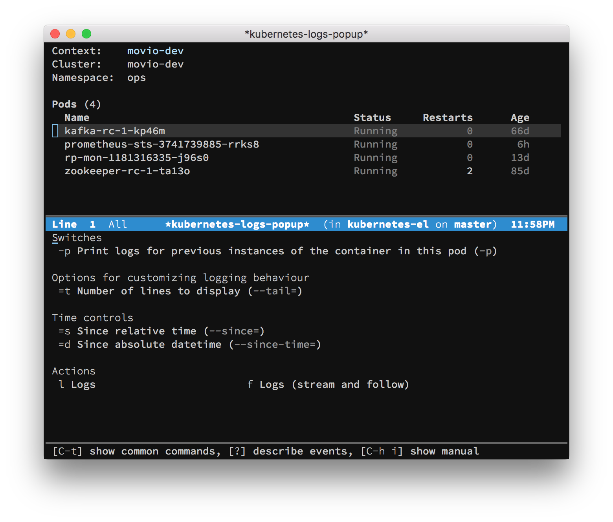

# kubernetes-el

[](https://github.com/kubernetes-el/kubernetes-el/actions/workflows/ci.yaml)
[](https://codecov.io/gh/kubernetes-el/kubernetes-el)
[](https://stable.melpa.org/#/kubernetes)
[](https://melpa.org/#/kubernetes)
[][COPYING]

Manage your Kubernetes clusters with Emacs.



See [docs/index.md](./docs/index.md) for details.

## Known Issues

Disabling automatic refresh helped many to solve [issue #100][]. For
example one can use the following configuration:

```elisp
(use-package kubernetes
  :ensure t
  :commands (kubernetes-overview)
  :config
  (setq kubernetes-poll-frequency 3600
        kubernetes-redraw-frequency 3600))
```


[Cask]: https://github.com/cask/cask
[COPYING]: ./COPYING
[Evil]: https://github.com/emacs-evil/evil
[contributing.org]: ./contributing.org
[issue #100]: https://github.com/kubernetes-el/kubernetes-el/issues/100
