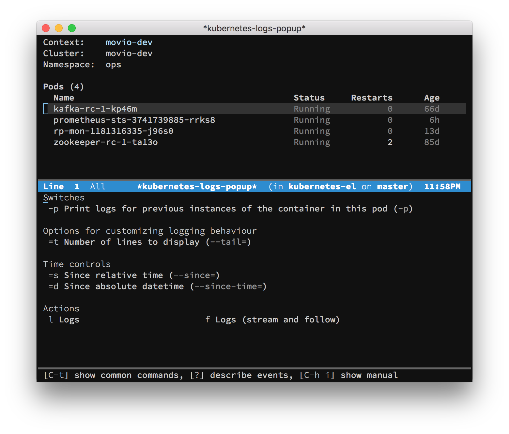

# kubernetes-el

A magit-style interface to the Kubernetes command-line client.



This project is in early stages, but the following are implemented:

- Live-updating list of pods
- Showing logs for the pods
- Exec'ing into a pod's docker container
- Describing pods
- Deleting pods
- Switching contexts.

## Usage

Run `M-x kubernetes-display-pods` to get started.

## Installation

Requires Emacs 25 and [Cask][].

```sh
git clone git@github.com:chrisbarrett/kubernetes-el.git
cd kubernetes-el
make && make install
```

Once you've set that up, use your preferred method of configuring packages. If
you use [use-package][], the form below will get you started.

```elisp
(use-package kubernetes
  :commands (kubernetes-display-pods)
  :config
  (use-package kubernetes-evil :after evil))
```

[Cask]: https://github.com/cask/cask
[Evil]: https://github.com/emacs-evil/evil
[use-package]: https://github.com/jwiegley/use-package
