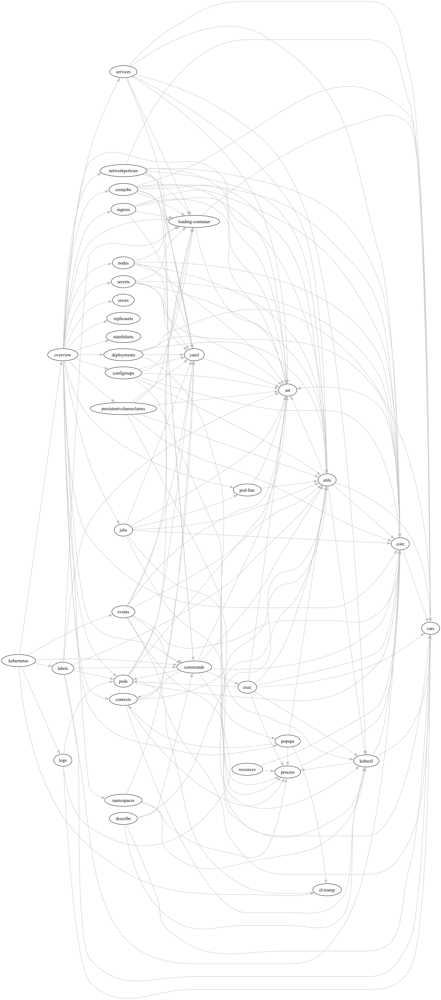

---
hide:
  - navigation
---

# Contributing

Hello there, intrepid contributor! Please see the [home page](index.md)
for basic information about this project.

If you would like to submit a bug report or contribute code or
documentation, read over the guidelines below for the expectations. Then
follow the development setup steps to get started.

## Contribution Guidelines

The first thing you should do is browse the GitHub issues for discussion
relating to the bug or feature you're interested in. Do your best here!

### Bug reports

Make sure you're using the latest release of the package.

If no ticket exists yet, you can write a new issue. Provide reproduction
steps if you can, as well as your Emacs version and basic OS info.

If the issue relates to integration with `kubectl`, make sure to supply
your `kubectl` version.

### Code changes

For code changes, please follow the following guidelines.

- Create a GitHub issue to track your work
- Fork the repository on GitHub
- Create a feature branch for your PR
- Take the time to write good commit messages;
  [here](https://www.freecodecamp.org/news/writing-good-commit-messages-a-practical-guide/)
  are some practical tips.
- Run tests and make sure they all pass before submitting your PR.
- If your contribution is a user-facing change, please add an entry to
  `CHANGELOG.org` in the `Unreleased` section detailing it. See
  [keepachangelog.com](https://keepachangelog.com/en/1.0.0/) for an
  overview of this process.
- Add yourself to the contributors list by commenting something like the following in your PR: `@all-contributors please
  add @<username> for <code/documentation/etc.>`. See [@all-contributors bot
  documentation](https://allcontributors.org/docs/en/bot/usage) for more details. See `.all-contributorsrc` for examples
  of contribution "types."

## Development setup

### Dependencies

See `Brewfile` for the project's non-Elisp dependencies. If you're developing on a Mac machine, you can install like so
from the project root:
```bash
$ brew bundle
```

If you're developing on a Linux machine, install these dependencies manually.

You do not need `kubectl` installed in order to run tests, but you do need it to run the package inside Emacs.

If you want to contribute code changes, you should fork the repository.  Otherwise clone the main repo.

=== "Forked"

    ```bash
    git clone "git@github.com:<username>/kubernetes-el.git"
    ```

=== "Otherwise"

    ```bash
    git clone "git@github.com:kubernetes-el/kubernetes-el.git"
    ```

Running make will tell you if you need to install anything to hack on
the project:

    cd kubernetes-el
    make

As a final check, run tests to make sure everything works. All tests
should pass.

    make test

## Implementation Notes

Below are some general notes to help make sense of this beast. The main
points to understand are:

- This package implements a state manager
- A timer is used to fetch information from Kubernetes and update the
  state
- Another timer is used to compile the state into a representation of
  the overview buffer, which is then interpreted.

The separation of state from rendering improves testability, and makes
it easier to develop view components that can be reused throughout the
package.

### State Management

This package implements its own state manager, which provides structured
mechanisms for accessing the application state. The state can be read
using the
[kubernetes-state](kubernetes-state.el::(defun%20kubernetes-state%20())
routine, and the package implements a suite of accessor functions for
reading and modifying specific parts of the state.

The core of the state manager is the function `kubernetes-state-next`, which is
a pure function taking the current state, an action to perform, and any
arguments required for that action. Its return value is the next application
state.

In order to actually make changes to the state, the `kubernetes-state-update`
routine is used to evaluate an action and arguments and store the updated
state. Other update routines are built around it, providing a more structured
interface to the state manager.

### State Updates

A timer is used to trigger polling processes which query Kubernetes for
its state and resources. This timer starts when the overview buffer is
opened, and repeats until that buffer is killed.

The polling timer runs a hook, `kubernetes-poll-hook`, which in turn
runs the polling routines that update the application state.

The routine `kubernetes-state-trigger-redraw` is the main routine used to
trigger a redraw. It runs a hook, `kubernetes-redraw-hook`, which is used to
signal that a redraw should occur. This routine is sometimes triggered manually,
but is most often triggered by the redraw timer. See `kubernetes-timers.el`.

Aside from the polling processes, certain interactive commands, popup
buffers and other UI elements can update parts of the state.

Rendering is mostly decoupled from state management, so redrawing occurs
asynchronously from state updates caused by polling. However, as a
special case a redraw is triggered the first time each state variable is
set. This ensures the UI displays values as soon as possible when the
porcelain is started.

### Rendering

This package implements a DSL (domain-specific language) used to specify
how objects should be rendered in the UI.

Rendering the overview buffer is divided into two stages:

1. Take the current state and compile an AST of the desired changes
2. Erase the buffer and interpret the AST to execute the changes
   ([here](kubernetes.el::;;%20Render%20AST%20Interpreter)).

Future optimizations could include dirty checking to only update certain
parts of the buffer.

`kubernetes-ast.el` contains the implementation of the interpreter for the
AST. It implements the core forms and provides a macro,
`kubernetes-ast-define-component`, that allows the interpreter to be extended
with custom components implemented in terms of the AST.

### Feature dependencies

The chart below shows the dependencies between features, excluding
`kubernetes-state`, `kubernets-props` and `kubernetes-modes` which are
direct dependencies of many modules.


