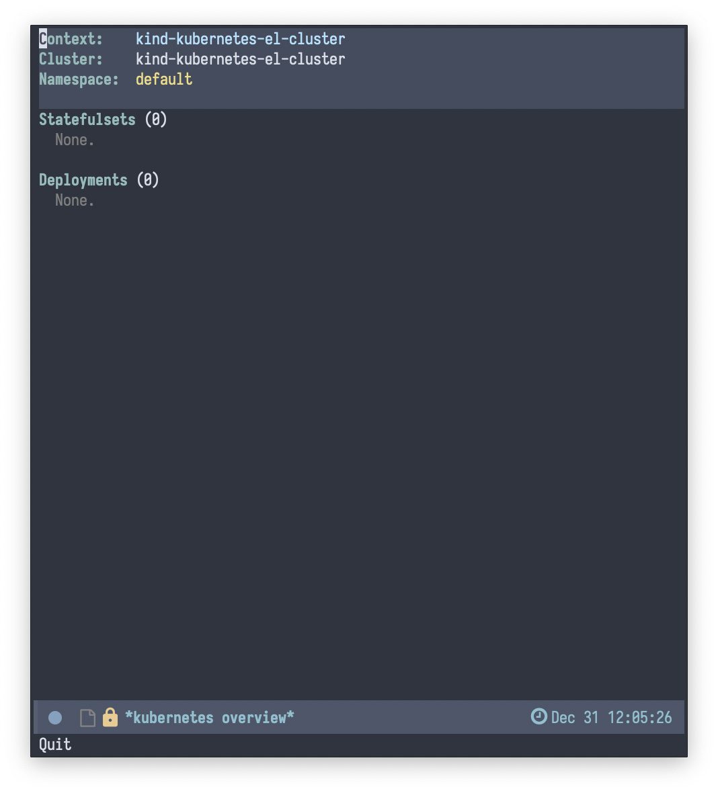

## About This Package

`kubernetes-el` is a Kubernetes client for Emacs. With `kubernetes-el` you can
manage your Kubernetes clusters much as you would with `kubectl`, but with
greater interactivity, less typing/copy-paste, and generally better ease-of-use.

`kubernetes-el` is still in early development stages, but we hope to enable
~80-90% of functionality you'd typically use `kubectl` for---with 10% of the
typing. :smile:

!!! warning

    This documentation assumes at least a working understanding of Kubernetes --
    what it is, its concepts, and how to work with it. If you're just beginning
    your Kubernetes journey, this documentation will do little to help you in
    that regard; we recommend looking elsewhere for general Kubernetes resources first.

!!! tip 

    `kubernetes-el` is secretly a wrapper around `kubectl`. Don't tell anyone.

!!! info "Regarding feature parity with `kubectl`"

    `kubernetes-el` serves a similar purpose to `kubectl`. **However**, it does
    not aim to be a full replacement for `kubectl`. Rather, `kubernetes-el`
    aims to provide Emacs-based access to most common use cases.

## Installation

### MELPA

This package is available on the [MELPA][] package repository. See the
instructions there for how to configure Emacs to pull packages from MELPA.

Once you've set that up, use your preferred method of configuring and installing
packages. If you use [use-package][], the forms below will get you started.

```elisp
(use-package kubernetes
  :ensure t
  :commands (kubernetes-overview))

;; If you want to pull in the Evil compatibility package.
(use-package kubernetes-evil
  :ensure t
  :after kubernetes)
```

Otherwise, you can install the packages with `M-x package-install`.

### Manual

!!! note

    Installing manually requires Emacs 25 and [Cask][].

```bash
git clone git@github.com:kubernetes-el/kubernetes-el.git
cd kubernetes-el
make && make install
```

## Start the package

To start the package, use the entry-point command `kubernetes-overview`.

```
M-x kubernetes-overview
```

!!! tip 

    You could consider defining a more concise alias for this command. For
    example, the following would allow you to enter the package via `M-x k8s`.

    ```emacs-lisp
    (fset 'k8s 'kubernetes-overview) 
    ```
    
You'll enter the Overview pane. This is where you'll likely spend the majority
of your time with `kubernetes-el` and where the majority of your interactions
will take place.



## Next Steps

You're done! Feel free to start poking around on your own; `describe-mode` will
give you a good overview. Otherwise, for more structured guidance, check out the
[Tutorials](./tutorials) section.

[Cask]: https://github.com/cask/cask
[MELPA]: http://melpa.milkbox.net/#/getting-started
[use-package]: https://github.com/jwiegley/use-package
