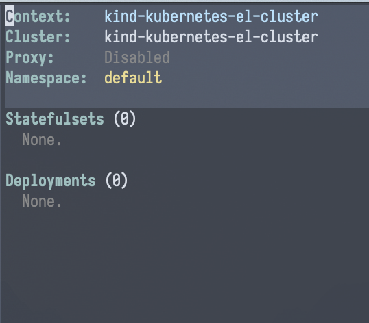

---
hide:
  - navigation
---

# How-To Guide

!!! tip inline end

    This page is structured loosely around the [CRUD][] paradigm.

This page provides "recipes" around how to perform common tasks with
`kubernetes-el`. It can be considered an authoritative (if not
necessarily comprehensive) overview of all that is possible with the
package.

## Interacting with `kubernetes-el`

### Enter the package

| Keybinding | Interactive function      |
|:-----------|:--------------------------|
| N/A        | `M-x kubernetes-overview` |

### Quit the package

| Keybinding | Interactive function                        |
|:-----------|:--------------------------------------------|
| `Q`        | `M-x kubernetes-kill-buffers-and-processes` |

`kubernetes-kill-buffers-and-processes` (`Q`) will kill all buffers
associated with `kubernetes-el`, as well as terminate all associated
background processes, e.g. those for querying resources.

## Create

## Read

### Changing contexts

| Keybinding | Interactive function                  |
|:-----------|:--------------------------------------|
| `C c`      | `M-x kubernetes-contexts-use-context` |

### Query CRDs

!!! missing "Not Yet Implemented"

    `kubernetes-el` is currently set up to only work with core resource kinds,
    and a limited subset of those at that.

    Work is currently in-progress to implement support for CRDs; see [issue #69][issue #69].

### Changing namespace

| Keybinding | Interactive function           |
|:-----------|:-------------------------------|
| `c n`      | `M-x kubernetes-set-namespace` |

!!! info

    It is currently not possible to view resources for multiple/all
    namespaces. See [issue #72][issue #72] for details.

## Update

### Renaming contexts

| Keybinding | Interactive function         |
|:-----------|:-----------------------------|
| `C r`      | `kubernetes-contexts-rename` |

## Delete

TODO.

## Connectivity

### Start/terminate a proxy server

| Keybinding | Interactive function |
|:-----------|:---------------------|
| `P P`      | N/A                  |

The overview buffer will update to reflect the new status of the proxy
server.

=== "Enabled"

    

=== "Disabled"

    

### Port-forwarding

!!! missing "Not Yet Implemented"

    See [issue #122][issue #122].

[issue #69]: https://github.com/kubernetes-el/kubernetes-el/issues/69
[issue #72]: https://github.com/kubernetes-el/kubernetes-el/issues/72
[issue #122]: https://github.com/kubernetes-el/kubernetes-el/issues/122
[CRUD]: https://en.wikipedia.org/wiki/Create,_read,_update_and_delete

*[CRDs]: Custom resource definitions
