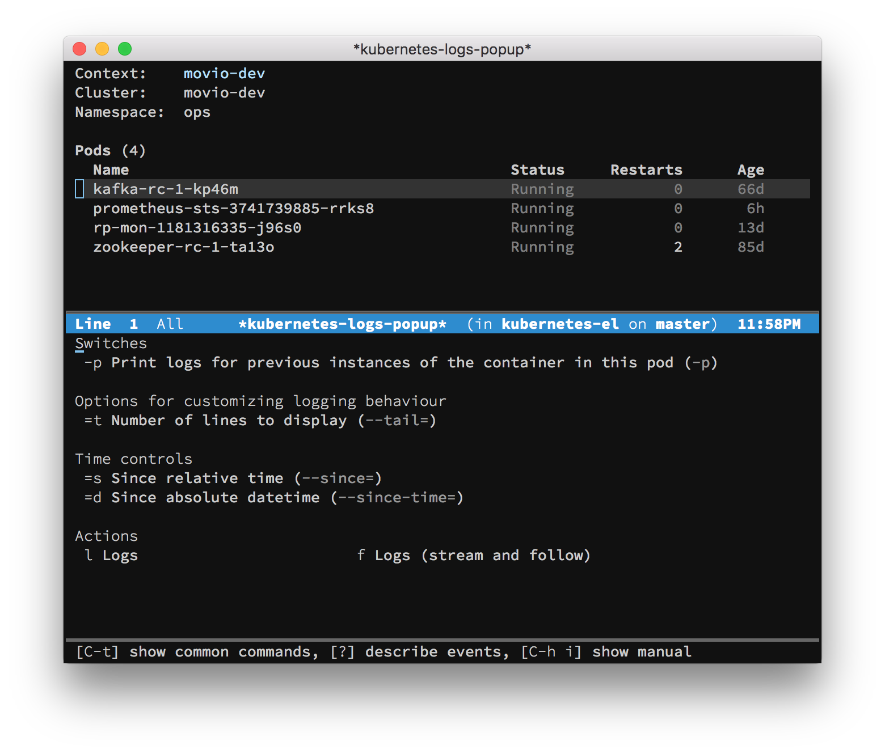

---
hide:
  - navigation
---

# kubernetes-el

{ width=60%; height=60%; align="right" }

Manage your Kubernetes clusters with Emacs.

## Feature Overview

With `kubernetes-el`, you can:

- View live-updated lists of Kubernetes resources;
- View manifests for core Kubernetes resources (Pods, Configmaps, Secrets,
  etc.);
- Edit various core Kubernetes resource kinds, e.g. Deployments and Configmaps;
- Fetch and follow logs;
- Exec into containers;
- Describe pods;
- Start and terminate a kubectl [proxy server][kubectl proxy];
- Much more.

[kubectl proxy]: https://kubernetes.io/docs/tasks/extend-kubernetes/http-proxy-access-api/

## Getting Started

=== "use-package"

    ```emacs-lisp
    (use-package kubernetes)
    ```

=== "straight.el"

    ```emacs-lisp
    (straight-use-package 'kubernetes)
    ```

    Or, if you use `straight.el` with `use-package`:

    ```emacs-lisp
    (use-package kubernetes
      :straight t)
    ```

Once you've installed, head over to [Getting Started](./getting-started/index.md) for more details.

## About these docs

These docs are structured roughly around the [Diátaxis](https://diataxis.fr/) documentation framework.

## Development roadmap

The project is actively being developed.

For known work items, see our [Issues page][issues].

For discussions about higher-level direction of the project and development
processes, see our [Discussions page][discussions].

--8<-- "docs/CONTRIBUTORS.md"

[COPYING]: ./COPYING
[Evil]: https://github.com/emacs-evil/evil
[MELPA]: http://melpa.milkbox.net/#/getting-started
[contributing.org]: ./contributing.org
[use-package]: https://github.com/jwiegley/use-package
[issue #100]: https://github.com/kubernetes-el/kubernetes-el/issues/100

[issues]: github.com/kubernetes-el/kubernetes-el/issues
[discussions]: https://github.com/kubernetes-el/kubernetes-el/discussions
[discussion #236]: https://github.com/kubernetes-el/kubernetes-el/discussions/236
